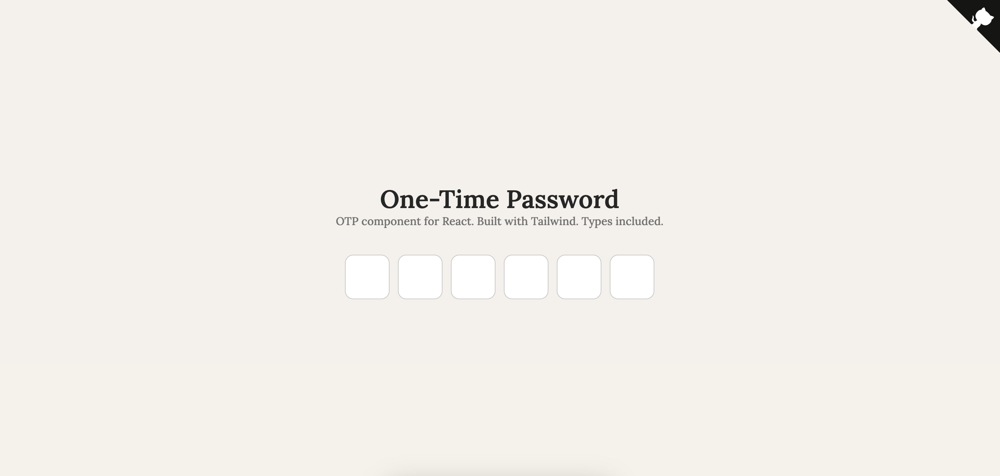

# OTP Component
A minimalistic one-time password component for React, built with Tailwind and Typescript.


## Basic Usage
- Copy the [component](./demo/src/components/OTP.tsx) to your own project
- Customise styles

```tsx
<OTP onComplete={(otp) => console.log(otp)} />

```

## Parameters
| Parameter  | Type             | Use                                                       |
|------------|------------------|-----------------------------------------------------------|
| onComplete | `(otp) => void;` | Function that will trigger once the password is filled in |
| length     | `number`         | Number of boxes, defaults to `6`                          |
| disabled   | `boolean`        | Disables the input, defaults to `false`                   |